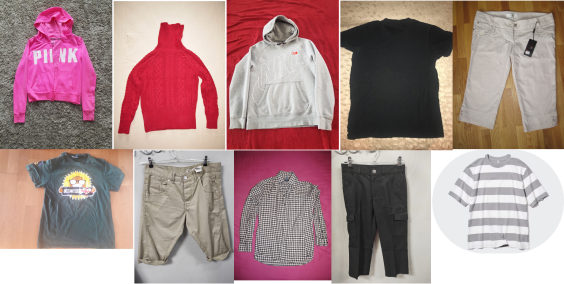

# Clothing Dataset LAMBI

  
We have compiled a dataset consisting of over 10,892 images belonging to 11 distinct classes. This dataset is the result of merging four different datasets, the links to which can be found below. The amalgamation of these datasets serves as our training set for developing and training the CNN model.

### Data

The Image Details

-   `Tshirts` - 1000 img
-   `Shirts` - 1000 img
-   `Skirts` - 1000 img
-   `Jackets` - 1000 img
-   `Jeans` - 1000 img
-   `Dresses` - 1000 img
-   `Longsleeve` - 1000 img
-   `Hoodie` - 1000 img
-   `pants` - 1000 img
-   `Shorts` - 992 img
-   `Tops` - 905 img

The `1000img.csv` file containts:

-   `image` - the ID of the image and image.jpg
-   `label` - the class type of the image

### Dataset Link

-   `LAMBI 1000img` - https://www.kaggle.com/datasets/1be72d011d491e848d93bc4363eb877db3ea7ec55d1a92460723130c88d50b2f

### Links Reference Dataset

-   `OLOLO` - https://www.kaggle.com/datasets/agrigorev/clothing-dataset-full
-   `PARAM AGGARWAL` - https://www.kaggle.com/datasets/paramaggarwal/fashion-product-images-dataset
-   `DOMINIC MONN` - https://www.kaggle.com/datasets/dqmonn/zalando-store-crawl
-   `HAMMAD ALI` - https://www.kaggle.com/datasets/hammaadali/real-fashion
